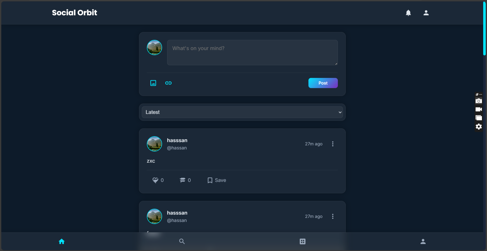
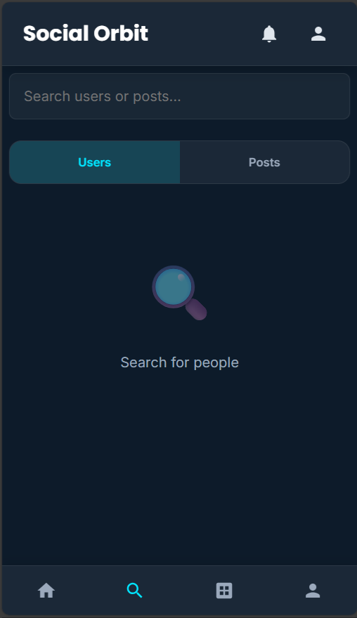
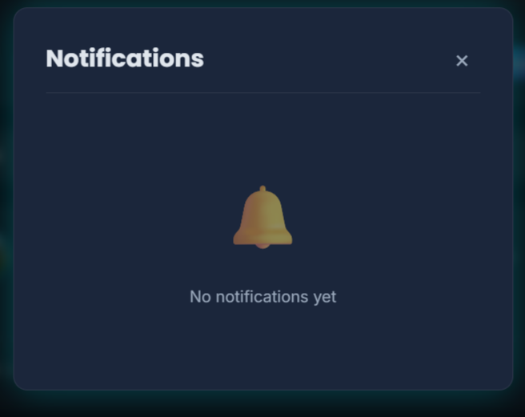

<h1 align="center">Social Orbit</h1>


A modern, responsive social media web application built with vanilla JavaScript, HTML, and CSS. Social Orbit allows users to create accounts, share posts with text, images, and links, interact with other users through likes and comments, and manage their profiles.





## Features

- **User Authentication**: Secure login and registration system
- **Post Creation**: Share text posts, images, and links
- **Social Interactions**: Like, comment, and save posts
- **Profile Management**: Customizable user profiles with stats
- **Notifications**: Real-time notifications for interactions
- **Responsive Design**: Works on mobile, tablet, and desktop
- **Modern UI**: Glassmorphism design with smooth animations
- **Post Filtering**: Sort posts by latest, oldest, most liked, or most commented

## Technologies Used

- **Frontend**: HTML5, CSS3, JavaScript (ES6+)
- **Styling**: Custom CSS with glassmorphism effects
- **Fonts**: Google Fonts (Poppins and Inter)
- **Icons**: SVG icons
- **Storage**: LocalStorage for data persistence
- **Responsive**: Mobile-first responsive design

## Getting Started

### Prerequisites

- A modern web browser (Chrome, Firefox, Safari, Edge)

### Installation

1. Clone the repository:
   ```bash
   git clone https://github.com/your-username/social-orbit.git
   ```

2. Navigate to the project directory:
   ```bash
   cd social-orbit
   ```

3. Open `index.html` in your web browser

Alternatively, you can double-click the `index.html` file to launch the application directly.

## Project Structure

```
social-orbit/
├── css/
│   ├── auth.css
│   ├── components.css
│   ├── feed.css
│   ├── profile.css
│   ├── responsive.css
│   ├── style.css
│   └── theme.css
├── js/
│   ├── all-posts.js
│   ├── app.js
│   ├── auth.js
│   ├── comments.js
│   ├── notifications.js
│   ├── posts.js
│   ├── profile.js
│   ├── search.js
│   ├── storage.js
│   ├── theme.js
│   ├── user.js
│   └── utils.js
├── pages/
│   ├── all-posts.html
│   ├── feed.html
│   ├── login.html
│   ├── profile.html
│   ├── register.html
│   ├── search.html
│   └── settings.html
├── index.html
└── README.md
```

## Key Components

### Authentication
- Secure user login and registration
- Session management
- Password validation

### Feed
- Main social feed displaying posts
- Create new posts with text, images, and links
- Like and comment functionality
- Post filtering options

### Profile
- User profile management
- Post statistics
- Edit profile options

### Notifications
- Real-time interaction notifications
- Notification badge indicator

## Local Storage

The application uses browser LocalStorage to persist:
- User accounts and sessions
- Posts and interactions
- User preferences
- Notification history

## Responsive Design

Social Orbit features a fully responsive design that works on:
- Mobile devices (320px and up)
- Tablets (768px and up)
- Desktops (1024px and up)

## Customization

You can customize the look and feel by modifying:
- `css/theme.css` - Color scheme and themes
- `css/style.css` - Core styles and components
- Font choices in `index.html` and other HTML files

## Contributing

1. Fork the repository
2. Create a feature branch (`git checkout -b feature/AmazingFeature`)
3. Commit your changes (`git commit -m 'Add some AmazingFeature'`)
4. Push to the branch (`git push origin feature/AmazingFeature`)
5. Open a pull request

## License

This project is licensed under the MIT License - see the [LICENSE](LICENSE) file for details.

## Acknowledgments

- Google Fonts for Poppins and Inter font families
- SVG icons from various open-source projects
- Inspiration from modern social media platforms

## Screenshots

### Main Feed


### Login Screen


### Notifications

